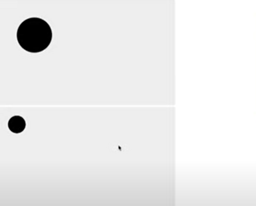
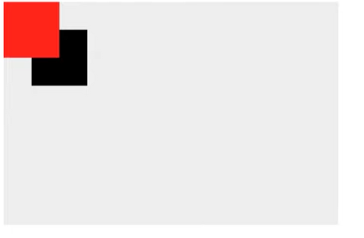

# Canvas API

Canvas API는 JavaScript와 HTML `<canvas>` 엘리먼트를 통해 그래픽을 그리기위한 수단을 제공 합니다.

무엇보다도 애니메이션, 게임그래픽, 데이터 시각화, 사진 조작 및 실시간 비디오 처리를 위해 사용됩니다.

Canvas API는 주로 2D 그래픽에 중점을 두고 있습니다. WebGL API 또한 `<canvas>` 엘리먼트를 사용하며, 하드웨어 가속 2D 및 3D 그래픽을 그립니다.


## 왜 Canvas를 사용할까?

canvas판에 그려지는 데이터 자체가 픽셀 데이터 하나하나를 비트맵 데이터 조작을 할 수 있기 때문에 일반 이미지나 HTML, CSS 로 할 수 없는 작업을 할 수 있기 때문에 사용합니다.

 >- 비디오를 잘게 쪼개어 위치를 바꾼다던지
 >- 이미지를 조각조각 내어 어떻게 한다던지
 >- 이미지들이 점점 사라지는 효과를 만들어 낸다던지.

이미지를 움직이거나 할 때에도 canvas를 사용하는게 일반적으로 성능이 좋기 때문에 사용합니다. 

Apple 같은 사이트에서 큰 비주얼을 움직일 때 canvas를 사용합니다.


## SVG vs Canvas 비교
>SVG는 백터

 - 백터는 점과 점을 계산해서 그리는 방식
 - 연산으로 그림을 그리기 때문에 크기가 아무리 커져도 용량이 늘어나지 않는다
 점의 갯수가 많아지면 연산이 늘어나고 렌더링이 느려질 수 있다.

 >Canvas는 비트맵
  - 픽셀 갯수가 많아지면 용량이 커진다.


## Canvas inline 너비 높이 값은 별개다.

  
```html
style {
    .canvas {
        width: 500px;
        height: 300px;
        background: #eee;
    }
}...

<canvas class="canvas" width="500" height="300"></canvas>
<canvas class="canvas" width="1000" height="600"></canvas>

 동그라미는 js에서 canvas로 그림.
```


 위 사진 결과가 다르게 표현되는 이유는 canvas 태그 안을 보면 inline으로 너비와 높이값이 다르게 설정되었기 때문이다.
 css로 처리해서 겉보기엔 같아 보이는 넓이와 높이를 가지고 있지만 inline으로 canvas 영역이 잡혀있기에 서로 다르게 표현된 것이다.

 canvas 영역을 더 크게 잡아두고 보이는 해상도 만큼 그리면 고해상도 이미지를 연출 할 수 있기 때문에 이러한 방법들을 사용한다고 한다.   

 단 그만큼 용량과 연산이 많아지기 때문에
 상황을 고려하여 사용하여야 한다.


 ## 사각형 그리기
 그림을 그릴 때 canvas의 context를 이용하여 그린다. 
 ```js
  const canvas = document.querySelector('.canvas');
  const context = canvas.getContext('2d');
  
  context.fillRect(50, 50, 100, 100)
  context.fillStyle = 'red';
  context.fillRect(0, 0, 100, 100);
 ```
1. canvas 요소를 잡는다.
2. 잡은 canvas 객체의 context를 얻기 위해 getContext를 호출하여 얻는다.( 2차원 렌더링 컨텍스트를 나타내는 "2d"를 이용)
3. 사각형을 그리는데 (x, y, width, height) 순서이고 x,y는 50, 50이고 width, heights는 100, 100을 의미함.
3. 사각형을 그릴 것 인데 채우는 색을 'red' 로 지정함.
4. 사각형을 그리는데 (x, y, width, height) 순서이고 x,y는 0,0이고 0,0은 왼쪽 좌측 상단을 의미함.

사각형 그리는 요소 
 - fillStyle 색을 정할 때 사용함
 - fillRect 사각형을 그릴 때 사용
 - clearRect 사각형을 지울 때 사용
 - strokeRect 는 선으로 사각형을 그릴 때 사용



default 색은 검정색 이어서 검정 사각형이 그려진 것이고 이 후 빨간색을 지정한 사각형이 그려졌다. 이 후 다른 도형을 그린다면 빨간도형으로 그려질 것이다.

> 🙄 빨간색으로 색이 지정된 것은 붓으로 빨간색을 찍었다 라고 생각해보자

> ✨ canvas는 마치 그림을 그리는 것처럼 생각하자 

## 선 그리기

```js
 <script>
    // beginPath
    // moveTo
    // lineTo
    // closePath
    const canvas = document.querySelector('.canvas');
    const context = canvas.getContext('2d');

    context.beginPath();
    context.moveTo(100, 100);
    context.lineTo(300, 200);
    context.stroke();
    // context.fill();
    context.closePath();
 </scirpt>
```

  - `context.beginPath();` 는 선의 시작을 알려주는 것
  - `context.moveTo(100, 100);` 그리는 것이 아니고 그리기 위해 해당 위치로 붓을 옮긴다 라는 의미
  - `context.lineTo(300, 200);` 는 선을 생성한다 여기서 그린다고 해서 바로 보이진 않음.
  - `context.stroke();` 선을 긋는다. 이제 선이 그려짐
  - `context.fill();` 면 이있다면 그 면의 색을 채워줌
  - `context.closePath();` path의 작성이 끝났으면 닫아준다.


## 원 그리기
```js
 <script>   
    // beginPath
    // arc
    // closePath
    const canvas = document.querySelector('.canvas');
    const context = canvas.getContext('2d');

    context.arc(300, 200, 50, 0, 360);
 </scirpt>
```
 원 그리기 메소드가 따로 있는 것은 아니고 'arc(호)' 를 사용하여 360 도 그린다

 - `context.arc(300, 200, 50, 0, 360);` 도형의 호를 의미함 
 원의 중심점을 기준으로 그리기 때문에 x,y는 원의 중심점을 의미하고 50은 원의 반지름 이다. 4,5번째 인자 (0, 360)은 호의 시작 각도, 끝 각도를 의미함. 360도를 그대로 쓰면 안되고 radian 값으로 적어야 한다.

 360 = 2PI,
 1 = PI / 180 값이 나온다.
 
 ```js
 function 라디안(각도) {
     return 각도  * Math.PI / 180;
 }

 context.arc(300, 200, 50, 0, 라디안(360), false);
 ```

 라디안(360)값은 2PI가 나오고 이 후 다른 각도를 알아볼 때 라디안 함수를 이용하여 구할 수 있다.

 마지막 boolean 값은 시계방향/반시계방향으로 그릴지 정하는 값이다.

 >❗ 현재까지 만들기만 하고 아직 원을 그린 상태는 아님
  
  ```js
 function 라디안(각도) {
     return 각도  * Math.PI / 180;
 }

 context.arc(300, 200, 50, 0, 라디안(360), false);
 context.stroke();
 ```
`context.stroke();` 선으로 그린다.
