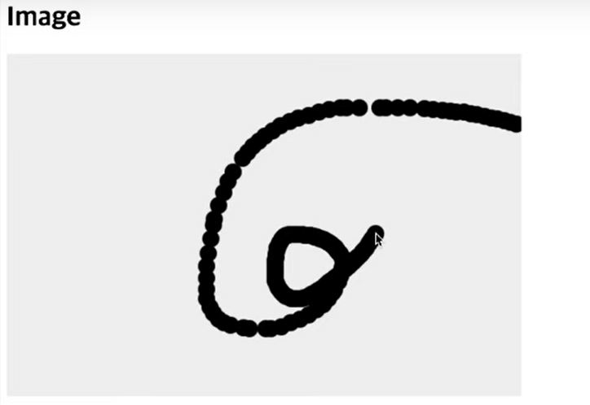

# canvas에서 Image 사용하기
```js
 const canvas = document.querySelector('.canvas');
 const context = canvas.getContext('2d');

//  const imgElem = document.createElement('img);
 const imgElem = new Image();
 imgElem.src = '../images/ilbuni1.png';
 imgElem.addEventListener('load', () => {
     context.drawImage(imgElem, 50, 50);
 })
```
canvas에서 image를 할 때 html에서 정의하는 것이 아니고 스크립트로 Image element를 생성하고 src 속성을 정의합니다.  
이 때 정의한 리소스는 외부 리소스 이기 때문에 
loading 시간이 필요하고 canvas에 그릴려면 이미지가 load가 끝나야 그릴 수 있기 때문에 image element에 addEventListener로 'load' 이벤트를 추가하고 콜백함수에서 context.drawImage() 를 통해 이미지를 그립니다.

첫 번째 인자는 그릴 이미지 객체를 넣고 2,3 번 째 인자는 x,y 값을 의미합니다.


```js 
 imgElem.addEventListener('load', () => {
     context.drawImage(imgElem, 50, 50);
     context.drawImage(imgElem, 50, 50, 70, 120);
     context.drawImage(imgElem, 100, 100, 200, 200, 0, 0, 100, 100);
 })
```

- 첫 번째 drawImage는 x,y 좌표에 이미지를 그립니다.

- 두 번째 drawImage는 x,y 좌표에 width, height 만큼의 크기로 이미지를 그립니다.

- 세 번째 drawImage는 원본사진 100, 100 좌표에서 200, 200만큼 잘라서 캔버스 0,0 좌표에 100, 100 width, height 만큼의 크기로 이미지를 그립니다.


  
## canvas 이용하여 그림 그리기
```js
 const canvas = document.querySelector('.canvas');
 const context = canvas.getContext('2d');

 function clickHandler(이벤트) {
     // 이벤트에 있는 clientX, clientY 는 브라우저 기준으로 좌표를 잡는다.
     // 이벤트에 있는 layerX, layerY는 캔버스 기준으로 좌표를 잡는다.
     
     context.beginPath();
     context.arc(이벤트.layerX, 이벤트.layerY , 10, 0, Math.PI*2, false);
     context.fill();
 }

 canvas.addEventListener('click', clickHandler); 
```


클릭할 때 마다 좌표에 그려지는 것을 확인할 수 있습니다. 그렇지만 클릭된 상태에서 마우스를 움직여 그릴 수 없는 상태입니다.

``` canvas.addEventListener('click', clickHandler); ``` 이 click 이벤트를 ```mousemove``` 이벤트로 변경해보면 이번엔 클릭하지 않아도 마우스를 움직일 때 그려지는 것을 확인할 수 있습니다. 



그렇지만 클릭하지 않아도 그려지는 것은 맘에 들지 않습니다!   
마우스를 누르고 있을 때 그려지고, 띄었을 땐 안그려지게 수정되어야 합니다.

```js
 const canvas = document.querySelector('.canvas');
 const context = canvas.getContext('2d');
 let drawingMode = false; // true일 때만 그리기

 function downHandler() {
    drawingMode = true;
 }

 function upHandler() {
     drawingMode = false;
 }

 function moveHandler(이벤트) {
     if (!drawingMode) return; 

     context.beginPath();
     context.arc(이벤트.layerX, 이벤트.layerY , 10, 0, Math.PI*2, false);
     context.fill();
 }

 canvas.addEventListener('mousedown', downHandler);
 canvas.addEventListener('mousemove', moveHandler);
 canvas.addEventListener('mouseup', upHandler);
```

drawingMode가 true 일 때만 그리게 한다면
원하는 효과를 얻을 수 있습니다.

```mousemove``` 이벤트 에서 drawingMode가  false 일 때는 return을 시킵니다.   
```mousedown``` 에서 drawingMode true로 변경 시키고 그 상태에서 마우스를 움직이면 그려집니다.  
```mouseup``` 에서 drawingMode false로 변경 시키면 그리는 것이 멈춰집니다.  


