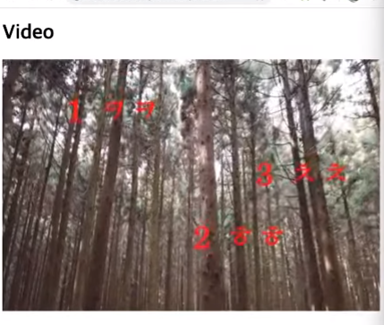
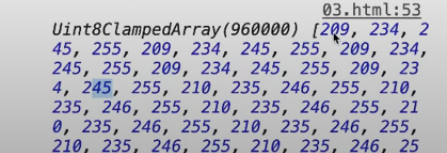

# canvas Video

```js
 const canvas = document.querySelector('.canvas');
 const ctx = canvas.getContext('2d');
 let canplayState = false;

 ctx.textAlign = 'center';
 ctx.fillText('비디오 로딩 중..', 300, 200);

 const videoElem = document.querySelector('.video');
 videoElem.addEventListener('canplaythrough', render);

 function render() {
     ctx.drawImage(videoElem, 0, 0, 600, 400);
     requestAnimationFrame(render);
 }
```
이미지는 load 이벤트 리스너를 사용했습니다.
비디오는 canplaythrough 이벤트 리스너를 사용합니다.

```videoElem.addEventListener('canplaythrough', render);``` 는 비디오가 재생 준비가 되면 호출됩니다.

render 콜백 함수를 보면 drawImage 메서드를 통해 비디오를 그리는 것을 확인할 수 있습니다.

drawImage는 3가지를 그릴 수 있습니다.
 1. Image
 2. Video
 3. 다른 canvas에 그려지는 것 을 그릴 수 있다.  

---
 ## Video 위에 낙서하기
 
 ```js
 const canvas = document.querySelector('.canvas');
 const ctx = canvas.getContext('2d');
 ctx.font = 'bold 50px serif';
 ctx.fillStyle = 'red';

const videoElem = document.querySelector('.video');

videoElem.addEventListener('canplaythrough', render);

const messages = [
    {time: 1, message: "1 ㅋㅋ", x: 100, y: 100},
    {time: 1, message: "2 ㅎㅎ", x: 300, y: 300},
    {time: 1, message: "3 ㅊㅊ", x: 400, y: 200},
]

 function render() {
     ctx.drawImage(videoElem, 0, 0, 600, 400);

     for (let i = 0; i < message.length; i++) {
         if (videoElem.currentTime > messages[i].time) {
             ctx.fillText(messages[i].message, messages[i].x, messages[i].y);
         }
     }

     requestAnimationFrame(render);
 }
 ```



```messages[i].time``` 시간보다 ```videoElem.currentTime``` 현재 시간이 커진 경우 message를 그립니다.

## canvas 에서 video를 사용하는 이유
그래픽적으로 조작이 가능하기 때문입니다.

```js
 const canvas = document.querySelector('.canvas');
 const ctx = canvas.getContext('2d');

 const videoElem = document.querySelector('.video');
 videoElem.addEventListener('canplaythrough', render);

 const btnsElem = document.querySelector('.btns');

 let imageData;
 const particles = [];
 let particle;
 let colorValue;
 let leng;

 function render() {
     ctx.drawImage(videoElem, 0, 0, 600, 400);
     imageData = ctx.getImageData(0, 0, 600, 400);
     leng = imageData.data.length / 4;

     for (let i = 0; i < leng; i++) {
         switch(colorValue) {
             case 'red':
                imageData.data[i * 4 + 0] = 255;
             break;
             case 'green':
                imageData.data[i * 4 + 1] = 255;
             break;
             case 'blue':
                imageData.data[i * 4 + 2] = 255;
             break;
         }
     }

     ctx.putImageData(imageData, 0, 0);
     requestAnimationFrame(render);

     btnsElem.addEventListener('click', function(e) {
         colorValue = e.target.getAttribute('data-color');
     });
 }
```
```ctx.getImageData```에 각 픽셀에  대한 색상정보를 가지고 있습니다.

> **getImageData** 로 받아온 imageData 변수를 console에 찍어보면 data, width, height 등 있습니다. 여기서 data 가 중요한데  **data 안에 픽셀 정보**가 들어 있습니다.



 render 함수에 switch 에서 ```i * 4```를 한 이유는 1픽셀당 4가지의 정보를 가지고 있기 때문에 ```*4``` 를 해준 것 입니다.

 배열을 보면```[209, 234, 245, 255, ...]``` 209는 R, 234는 G, 245는 B, 255는 투명도 이렇게 4가지 정보가 하나의 픽셀 정보라서 4를 곱해준 이유 입니다. 

 배열의 총길이가 96만개로 나오는데 이유는

 현재 600*400 캔버스 사이즈는 24만 픽셀이고 * 4를 하면 96만개의 픽셀정보 배열을 나타냅니다.  

 ```js
  leng = imageData.data.length / 4;

     for (let i = 0; i < leng; i++) {
         switch(colorValue) {
             case 'red':
                imageData.data[i * 4 + 0] = 255;
             break;
             case 'green':
                imageData.data[i * 4 + 1] = 255;
             break;
             case 'blue':
                imageData.data[i * 4 + 2] = 255;
             break;
         }
     }
 ```

 이 부분에서 ```leng```은 imageData.data.length / 4를 하니까 24만 값이 담깁니다.

 for문에서 24만번을 반복하는데 case에 따라
 해당 픽셀값을 하나하나 수정하는 작업을 의미합니다.

 +0, +1, +2 를 해준 이유는 각 RGB 에 맞는 index 값을 수정하기 위해 i*4 를 한 뒤  숫자들을 더해주면 해당 색을 수정할 수 있기 때문입니다.

 imageData가 수정이 완료 되었으면 수정한 것으로 변경 하기 위해선 putImageData를 이용해 변경하면 됩니다.

 > ```ctx.putImageData(imageData, 0, 0);```

