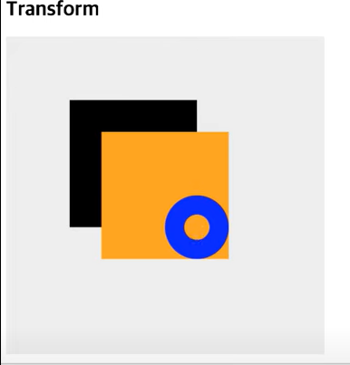
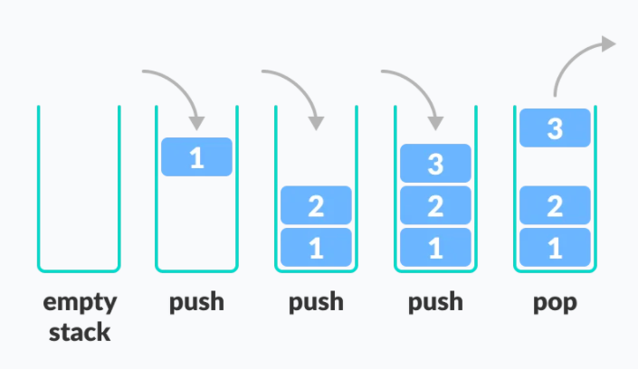
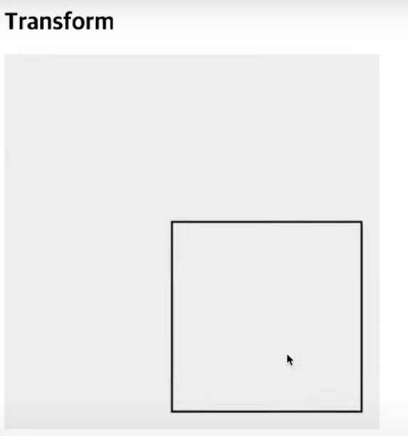
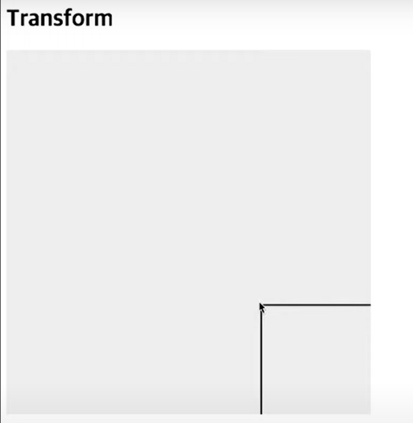
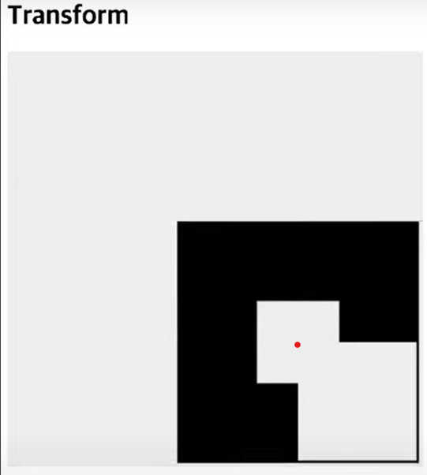

# TransForm

```js
const canvas = document.querySelector('.canvas');
const context = canvas.getContext('2d');

// 1번째 사각형
context.fillRect(100, 100, 200, 200);
context.fillStyle = 'orange';
// 2번째 사각형
context.fillRect(150, 150, 200, 200);

context.save();

context.fillStyle = 'blue';
context.beginPath();
// 3번째 원
context.arc(300, 300, 50, 0, Math.PI * 2, false);
context.fill();

context.restore();

context.beginPath();
// 4번째 원
context.arc(300, 300, 50, 0, Math.PI * 2, false);
context.fill();
```



1번째 사각형을 그린뒤 fillStyle로 색상을 orange로 변경 후 다시 2번째 사각형을 그렸습니다.

fillStyle을 blue로 변경하고 300,300 위치에 3번째 원을 그리고 또 한번 같은 위치에 4번째 작은 원을 그렸습니다.

> 잠깐!🖐 4번째 원의 결과는 파란색 원이라고 생각했습니다만..  
orange 원이 그려졌습니다.😲

마지막 fillStyle을 blue로 변경한 후 다른색으로 변경 한적이 없는데 어떻게 orange색으로 그려진 것일까요?

### 그것은 바로..save 와 restore

**`save()`**

- canvas의 모든 상태를 저장합니다.

**`restore()`**

- 가장 최근에 저장된 canvas 상태를 복원합니다.

  Canvas 상태는 **스택(stack)** 에 쌓입니다. `save()` 메소드가 호출될 때마다 현재 drawing 상태가 스택 위로 푸시됩니다.

  위 코드를 다시 보면 save 호출 시 canvas 상태를 저장하고, 임시로 색상을 blue로 변경 후 원을 그렸습니다.

  그런 다음 restore로 다시 이전 상태로 복원하고 원을 그리면 orange 색으로 원이 그려집니다.  
  <br />

  > 스택 구조로 쌓이기 때문에 초기 save --> 가장 최근 save 순서로 쌓입니다.
   restore 하면 가장 최근 것 부터 pop 되게 됩니다.

  

## Transform 이용하여 사각형 그리기

```js
const canvas = document.querySelector('.canvas');
const context = canvas.getContext('2d');

let scaleValue = 1;

function draw() {
  context.clearRect(0, 0, canvas.width, canvas.height);
  context.save();
  context.setTransform(1, 0, 0, 1, 0, 0);
  context.translate(350, 350);
  context.scale(scaleValue, scaleValue);
  scaleValue += 0.001;
  context.strokeRect(- 50, -50, 100, 100);
  context.restore() ;
 
  requestAnimationFrame(draw);
}

draw();
```

draw 함수를 살펴보면

- `translate`를 통해 점의 좌표를 350, 350 좌표로 이동 시켰습니다.
- `scale`를 통해 크기를 키웁니다.
- scaleValue는 0.001 크기만큼 증가합니다.
- strokeRect는 -50, -50 좌표에 100,100 크기의 사각형을 그립니다. **여기서 -50, -50 좌표는 350, 350 으로 이동된 점의 좌표에서 -50씩 이동한 좌표를 의미합니다.**
- `clearRect`를 통해 그려진 캔버스를 지웁니다.
- `save`는 설정한 canvas 상태를 저장합니다. 즉 `clearRect` 까지 설정한 상태를 저장합니다.
- `restore`를 통해 다시 이전 상태(`clearRect가 설정되어있는 상태`)로 복원시킵니다.
- 해당 좌표에서 커지는 애니메이션 효과가 연출 됩니다.
-  ```setTransform```은 변환을 초기화 해주는 역할을 합니다. 변환할 때 행렬을 이용하는데 setTransform(1,0,0,1,0,0) 값은 단위행렬을 의미합니다.

> 👵 단위행렬: 행렬에 어떤 값을 곱했을 때 값의 변화가 없다 = 단위행렬로 만든다 = 변환을 초기화 한다 

<br />
<br />


### # 다양한 예 

> translate로 350,350 이동 후 strokeRect 좌표를 **-50, -50** 한 경우  



<br />

> translate로 350,350 이동 후 strokeRect 좌표를 **0, 0** 한 경우  




<br />

 > save, restore 주석처리 한 경우

```js
function draw() {
  context.clearRect(0, 0, canvas.width, canvas.height);
//   context.save();
  context.setTransform(1, 0, 0, 1, 0, 0);
  context.translate(350, 350);
  context.scale(scaleValue, scaleValue);
  scaleValue += 0.001;
  context.strokeRect(-50, -50, 100, 100);
//   context.restore();

  requestAnimationFrame(draw);
}
```

<br />  

 

> 잠깐🖐 clearRect는 해당 영역을 다 지우고 다시 그리는데 왜 이렇게 나오는 걸까?

<br />  

위 처럼 결과가 나오는 이유는 점의 좌표를 350,350 이동시켜 놓은 상태에서 그럼 해당 위치한 곳(빨간점)이 0,0 기준이 되고 그 기준으로 canvas 너비,높이 만큼 지웠기 때문에 이런 결과가 나온것!!  

## Transform 이용하여 사각형 회전 시키기
```js
const canvas = document.querySelector('.canvas');
const context = canvas.getContext('2d');

let scaleValue = 1;
let rotaionValue = 0;

function toRadian(d) {
  return d * Math.PI/180;
}

function draw() {
  context.clearRect(0, 0, canvas.width, canvas.height);
  context.save();
  context.setTransform(1, 0, 0, 1, 0, 0);
  context.translate(350, 350);
  context.scale(scaleValue, scaleValue);
  context.rotate(toRadian(rotationValue));  
  context.strokeRect(-50, -50, 100, 100);
  context.restore();

  scaleValue += 0.001;
  rotationValue += 1;

  requestAnimationFrame(draw);
}

draw();
``` 

도형을 회전시키기 위해 rotate를 사용하는데 원을 그리기 위해 들어가는 각도는 radian 을 이용한 값이 들어가야 합니다.

```toRadian``` 이라는 함수를 만들었고 rotate에 전달할 때 ```rotationValue```이 증가할 때마다 toRadian함수를 통해 각도가 계산되어 적용됩니다.


<br />

감사합니다 ^^!