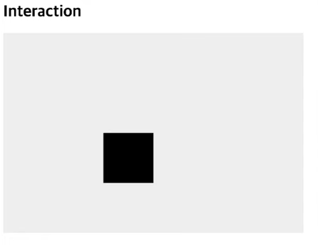
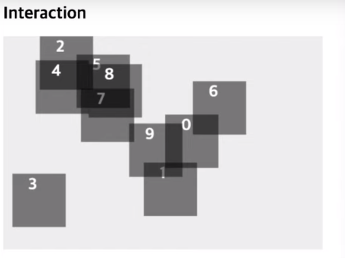
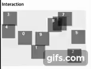

# Interaction

```js
 const canvas = document.querySelector('.canvas');
 const context = canvas.getContext('2d');

 context.fillRect(200, 200, 100, 100);


function clickHandler(e) {
    const x = e.layerX;
    const y = e.layerY;

    if (x > 200 && x < 200 + 100 &&
        y > 200 && y < 200 + 100) {
        console.log('box click');
    }
}

canvas.addEventListener('click', clickHandler);
``` 

  

canvas 위에는 따로 element 요소가 잡히지 않아서 따로 좌표로 해당 영역을 인식해서 이벤트가 발생되어야 합니다.

```clickHandler``` 이벤트 객체에 layerX, layerY는 layer 위에 있는 영역의 좌표 x,y를 의미하고 이 예제에서는 canvas를 의미합니다.
  
x 좌표는 200보다 크면서 200 x좌표 + 100너비 이내를 클릭했을 때 인식되어야 하고 y좌표도 마찬가지로 200 y좌표 보다 크면서 200 y좌표 + 100 높이 이내 일 때 console이 찍히는 코드입니다.


## 각 인스턴스 도형 그리기



```js 
 const canvas = document.querySelector('.canvas');
 const context = canvas.getContext('2d');
 const boxes = [];

 class Box {
     constructor(index, x, y) {
         this.index = index;
         this.x = x;
         this.y = y;
         this.width = 100;
         this.height = 100;
         draw();
     }

     draw() {
         context.fillStyle = 'rgba(0,0,0,0.5)';
         context.fillRect(this.x, this.y, this.width, this.height);
         context.fillStyle = '#fff';
         context.fillText(this.index, this.x+30, this.y+30);
     }
 }

let tempX, tempY;

 for (let i = 0; i < 10; i ++) {
     tempX = Math.random * 600 * 0.8;
     tempY = Math.random * 400 * 0.8;
     boxes.push(new Box(i, tempX, tempY));
 }
```

반복문을 이용하여 각 인스턴스 별 상자를 생성했습니다.  
 상자별 번호를 설정하는 fillText에서는 x,y좌표 0,0 위치에서 살짝 떨어지게 +30 하여 설정했습니다.  

 각 인스턴스 별 클릭 시 console이 찍히도록 코드를 추가해보겠습니다.


 ```js
 const canvas = document.querySelector('.canvas');
 const context = canvas.getContext('2d');
 const boxes = [];
 const mousePos = {x: 0, y: 0};

 class Box {
     constructor(index, x, y) {
         this.index = index;
         this.x = x;
         this.y = y;
         this.width = 100;
         this.height = 100;
         draw();
     }

     draw() {
         context.fillStyle = 'rgba(0,0,0,0.5)';
         context.fillRect(this.x, this.y, this.width, this.height);
         context.fillStyle = '#fff';
         context.fillText(this.index, this.x+30, this.y+30);
     }
 }

let tempX, tempY;

 for (let i = 0; i < 10; i ++) {
     tempX = Math.random * 600 * 0.8;
     tempY = Math.random * 400 * 0.8;
     boxes.push(new Box(i, tempX, tempY));
 }

 canvas.addEventListener('click', e => {
     mousePos.x = e.target.layerX;
     mousePos.y = e.target.layerY;

     let box;
     for (let i = 0; i < boxes.length; i++) {
         box = boxes[i];

         if (mousePos.x > box.x &&
            mousePos.x < box.x + box.width &&
            mousePos.y > box.y &&
            mousePos.y < box.y + box.height) {
                console.log(box.index);
            }
     }
 })

 ```


각 상자를 클릭하면 인덱스 번호가 console이 찍힙니다.
그런데 겹쳐 있는 경우는 겹쳐있는 index가 전부 찍히게 됩니다.   

이유는 클릭한 좌표로 인식을 하기 때문입니다.  
> 🙄그럼 겹쳐 있더라도 맨 위에 있는 상자만 찍히려면 어떻게 해야할까요? 

겹치는 부분을 클릭 하더라도 마지막(index 번호가 높은) 부분만 마지막에 담기게 되도록 수정하면 될 것 같습니다. 

 ```js
 const canvas = document.querySelector('.canvas');
 const context = canvas.getContext('2d');
 const boxes = [];
 const mousePos = {x: 0, y: 0};
 let selectedBox; // 선택된 박스

 class Box {...}
  
let tempX, tempY;

 for (let i = 0; i < 10; i ++) {
     tempX = Math.random * 600 * 0.8;
     tempY = Math.random * 400 * 0.8;
     boxes.push(new Box(i, tempX, tempY));
 }

 canvas.addEventListener('click', e => {
     mousePos.x = e.target.layerX;
     mousePos.y = e.target.layerY;

     let box;
     for (let i = 0; i < boxes.length; i++) {
         box = boxes[i];

         if (mousePos.x > box.x &&
            mousePos.x < box.x + box.width &&
            mousePos.y > box.y &&
            mousePos.y < box.y + box.height) {
                selectedBox = box;
            }
     }

     console.log(selectedBox);
 })

 ```

 ```selectedBox``` 변수를 추가하고 거기에 box를 할당하여 최종 ```box```가 담기도록 수정하였습니다.


 ## 박스 이동하기 (애니메이션 효과)

 ```js
    ...중략

    function render() {
        context.clearRect(0, 0, canvas.width, canvas.height);
        let box;
        for (let i = 0; i < boxes.length; i++) {
            box = boxes[i];
            box.x += 3;
            box.draw();
        }

        requestAnimationFrame(render);
    }   

    render(); 
 ```

 requestAnimationFrame이 실행되는  ```render```는 x좌표로 3씩 증가하면서 그려진 박스를 지우고 다시 그리면서 오른쪽으로 이동하게 됩니다.  

 여기서 박스가 canvas 너비를 벗어나게 되면 다시 처음부터 이동하게 되는 조건을 추가하겠습니다.

 ```js
   ...중략

    function render() {
        context.clearRect(0, 0, canvas.width, canvas.height);
        let box;
        for (let i = 0; i < boxes.length; i++) {
            box = boxes[i];
            box.x += 3;
            if (box.x > canvas.width) {
                box.x = -box.width;
            }
            box.draw();
        }

        requestAnimationFrame(render);
    }   

    render(); 
 ```
```if``` 조건문을 추가하여 x 좌표가 canvas width를 초과하게 되면 x 좌표를 0보다 작은 박스 너비(-100) 좌표에서 그리게 되면 자연스러운 이동처럼 보이게 됩니다.

## 각 인스턴스 별 속도를 다르게 이동하기

 

```js
 const canvas = document.querySelector('.canvas');
 const context = canvas.getContext('2d');
 const boxes = [];
 const mousePos = {x: 0, y: 0};
 let selectedBox; // 선택된 박스

  class Box {
     constructor(index, x, y, speed) {
         this.index = index;
         this.x = x;
         this.y = y;
         this.width = 100;
         this.height = 100;
         this.speed = speed;
         draw();
     }

     draw() {
         context.fillStyle = 'rgba(0,0,0,0.5)';
         context.fillRect(this.x, this.y, this.width, this.height);
         context.fillStyle = '#fff';
         context.fillText(this.index, this.x+30, this.y+30);
     }
 }

  function render() {
        context.clearRect(0, 0, canvas.width, canvas.height);
        let box;
        for (let i = 0; i < boxes.length; i++) {
            box = boxes[i];
            box.x += box.speed;
            if (box.x > canvas.width) {
                box.x = -box.width;
            }
            box.draw();
        }

        requestAnimationFrame(render);
    }   
  
let tempX, tempY, tempSpeed;

 for (let i = 0; i < 10; i ++) {
     tempX = Math.random * 600 * 0.8;
     tempY = Math.random * 400 * 0.8;
     tempSpeed = Math.random * 4 + 1;
     boxes.push(new Box(i, tempX, tempY, tempSpeed));
 }

 ...중략

 render();

 ```

 ```Box Class``` 의 ```constructor```에  매개변수와 내부 상태값 speed 를 추가하였습니다.

 ```tempSpeed``` 변수를 추가 하였고 속도는 1~5 사이의 숫자를 랜덤하게 뽑기 위해 ```Math.random*4 + 1``` 수식으로 하였습니다.   

 랜덤값의 최소값은 0 기 때문에 1 이상이어야 해서 ```+1``` 을 하였고 5 이내의 범위이기 때문에 ```*4```를 하였습니다.


<br />

감사합니다 ^^!