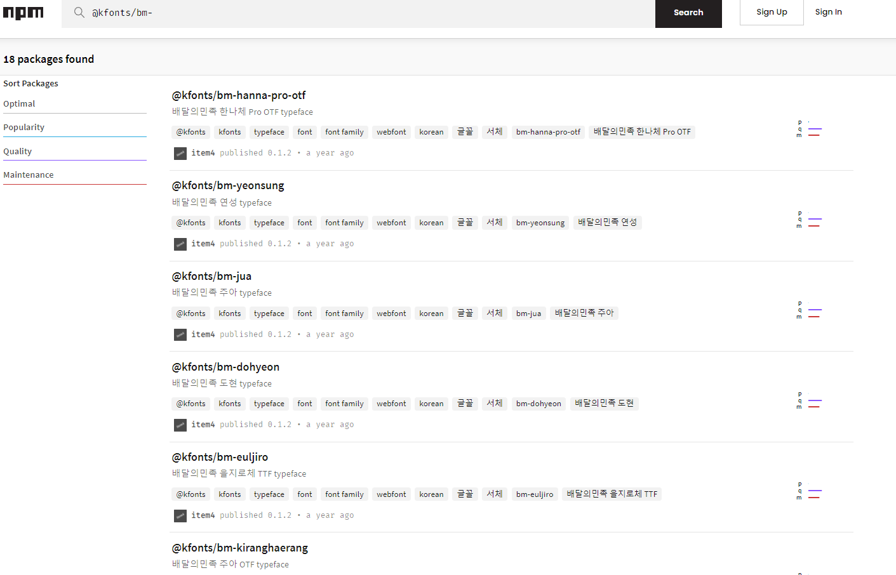

# Gatsby 블로그에 배민 폰트 적용하기✍


###  1. 원하는 폰트를 [npm](https://www.npmjs.com/) 에서 찾습니다.  

   

### 2. 폰트를 설치합니다.  

   

 ```js
 npm i @kfonts/bm-hanna-11yrs
 ```

 ### 3. 설치받은 폰트를 ```gatsby-browser.js``` 파일에 import 합니다  

   

 

 ### 4. src/styles 폴더에 있는 ```dark-theme.scss``` 와 ```light-theme.scss``` 에 폰트를 적용합니다.  

 


### 5. 적용 완료✨

 - light 모드 


 - dark 모드


  
    
감사합니다. ^^!